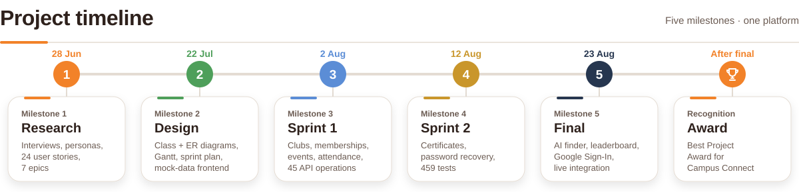
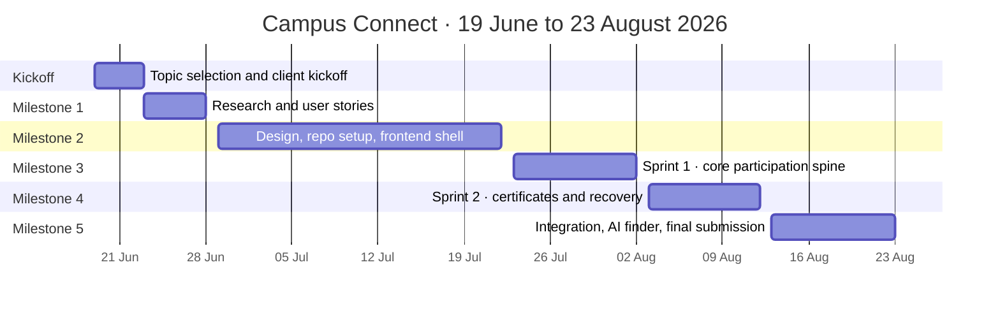

<picture>
  <source media="(prefers-color-scheme: dark)" srcset="../assets/timeline-dark.svg">
  
</picture>

How **Campus Connect** went from a topic debate to a deployed, award-winning platform. Team NexMind (Team-003), BSCS3001 Software Engineering Project, May 2026 term, IIT Madras BS Degree. Every date below comes from the team's five milestone reports.

<picture>
  <source media="(prefers-color-scheme: dark)" srcset="../assets/divider-dark.svg">
  
</picture>

## Roadmap at a glance

| Milestone | Date | Focus | Headline result |
|---|---|---|---|
| **1** | 28 Jun 2026 | Identify user requirements | 24 user stories across 7 epics from 3 interviews and 1 written submission |
| **2** | 22 Jul 2026 | Scheduling and design | Class and ER diagrams, sprint plan, Gantt, deployed frontend on mock data |
| **3** | 2 Aug 2026 | Sprint 1 · core platform APIs | 45 API operations, 399 test cases, 19 of 20 committed stories delivered |
| **4** | 12 Aug 2026 | Sprint 2 · extended features | Certificates, password recovery, 459 tests, 50 API operations |
| **5** | 23 Aug 2026 | Final testing and submission | AI club finder, leaderboard, Google Sign-In, live end-to-end integration |

<picture>
  <source media="(prefers-color-scheme: dark)" srcset="../assets/divider-dark.svg">
  
</picture>

## Before Milestone 1: choosing the problem

| Date | What happened |
|---|---|
| **19 Jun** | Feasibility study comparing Campus Connect with a Resident Welfare Association (RWA) platform. The team leaned towards Campus Connect |
| **22 Jun** | Client kickoff. The team pitched an RWA housing-society concept and got critical feedback on feature specificity and timeline feasibility. Trello adopted for tracking |
| **23 Jun** | After debriefing on the feedback, the team unanimously **switched back to Campus Connect** |

## Milestone 1 : Research (28 Jun 2026)

Established the problem: club discovery, membership, events, attendance, results and certificates were each handled in a different informal tool (Instagram DMs, WhatsApp, Google Forms, Sheets, Canva).

- **Research:** interviews with a student and two club leaders, plus a written submission from a student body representative.
- **Output:** primary, secondary and tertiary user groups, a pain-point analysis, and **24 user stories in 7 epics**.
- **Scope control:** a future-scope list (AI drafting, event recaps, federated discovery, budget tracking and others) so out-of-scope ideas couldn't re-enter later sprints.

## Milestone 2 : Design (22 Jul 2026)

| Date | What happened |
|---|---|
| **29 Jun** | Development tasks assigned. Repo rules set: `main` locked to deployable code, features merged through pull requests into `dev` |
| **2 Jul** | Vue Composition API standardised. Custom CSS only, no Tailwind or Bootstrap |
| **6 Jul** | Project-wide Gantt chart adopted as the official roadmap |
| **7 Jul** | Roles clarified. Communication moved to bi-weekly meetings plus twice-daily async status updates |
| **8 Jul** | Client review: live walkthrough of the deployed, mock-data frontend. Client approved the frontend and Git workflow; Neon Postgres and FastAPI confirmed |
| **22 Jul** | Milestone 2 submitted. Sprint 1 backlog walked through and ownership confirmed |

**Delivered:** component design, class diagram, ER diagram, sprint schedule, a Trello board, and a responsive frontend built on mock data with every route connected.

## Milestone 3 : Sprint 1 (23 Jul to 2 Aug 2026)

Turned the design into a working, documented and tested REST backend, then wired the frontend to it. Daily async stand-ups at 9:00 AM and 9:00 PM.

- **Delivered:** the participation spine (publish an event, register, check in, record a result) and the club and membership lifecycle behind it. Also announcements, issues and notifications.
- **By the numbers:** 45 API operations across 37 paths, 399 test cases, 19 of 20 committed stories delivered.
- **Quality:** four functional defects (BUG-01 to BUG-04) found by tests and fixed, plus one documentation gap (DOC-01) tracked openly.
- **Carried over:** the AI Club Finder (Story 6.1), reported honestly as not delivered.
- **Demo feedback** from the same users interviewed in Milestone 1: Google sign-in and forgot-password, an event reminder, bulk check-in, default-and-override results, a seen count on announcements.

## Milestone 4 : Sprint 2 (3 to 12 Aug 2026)

Responded directly to the Sprint 1 demo.

- **Delivered:** the certificate module (auto-generated PDFs, student wallet, public verification by serial number and QR code), a single default-and-override result endpoint (F-02), an event reminder notification (F-03), and password recovery end to end (F-06).
- **By the numbers:** 50 API operations across 42 paths, 459 test cases, zero new functional defects.
- **Carried to Milestone 5:** AI Club Finder (rebuilt as an agentic module), leaderboard (Story 7.1), bulk check-in (F-01), announcement seen count (F-04), and the DOC-01 spec fix (F-05).
- **Withdrawn after review:** a written reason on club rejection, and an expiry on pinned announcements.
- **A deliberate gap:** attendance, results, certificates and notifications were backend-complete but not yet wired to the frontend. The team held them back rather than rush a chain of coupled modules in the last days of the sprint, and said so in the report.

## Milestone 5 : Final submission (23 Aug 2026)

| Date | What happened |
|---|---|
| **13 to 14 Aug** | Internal Sprint 2 retrospective (planned in the Milestone 4 report) |
| **From 16 Aug** | Client demo window for the Sprint 2 build (exact date was to be confirmed) |
| **23 Aug** | Final submission |

**Closed out in the final milestone:**

- Google Sign-In, and password recovery verified with a real email through production SMTP.
- The club activity leaderboard (Story 7.1).
- The AI Club Finder, rebuilt as a bounded tool-calling agent on real club and event data.
- Real S3 uploads for club banners and profile pictures.
- Frontend integration of notifications, attendance, results and certificates, plus an app-wide UI and empty-state pass.
- All carried-over issues closed: 9 closed GitHub issues, 0 carried forward.

**Submitted:** project video, complete code zip, this final report compiling Milestones 1 to 5, and the live frontend and API.

## Recognition

🏆 **Campus Connect won the Best Project Award.** The reports don't record the date, so this sits after the final submission.

<picture>
  <source media="(prefers-color-scheme: dark)" srcset="../assets/award-certificate.svg">
  
</picture>

## How user feedback shaped the build

The same primary and secondary users were interviewed in Milestone 1 and shown every sprint build, so feedback was continuous rather than gathered from a fresh audience each time.

| What users asked for | Raised at | Outcome |
|---|---|---|
| Forgot password | Sprint 1 demo | Delivered in Milestone 4 |
| Google Sign-In | Sprint 1 demo | Delivered in Milestone 5 |
| Event reminder before the start time | Sprint 1 demo | Delivered in Milestone 4 |
| Default-and-override results (one action, everyone else a participant) | Sprint 1 demo | Delivered in Milestone 4 |
| Certificate alongside the result | Sprint 1 demo | Generated automatically in Milestone 4, wired to the profile in Milestone 5 |
| Search clubs by describing interests | Sprint 1 demo | AI Club Finder, delivered in Milestone 5 |
| A visible signal of which clubs are active | Sprint 1 demo | Leaderboard, delivered in Milestone 5 |
| Bulk check-in with a searchable roster | Sprint 1 demo | Carried from Milestone 4, closed in Milestone 5 |
| Seen count on announcements | Sprint 1 demo | Carried from Milestone 4, closed in Milestone 5 |
| Written reason on club rejection, expiry on pins | Sprint 1 demo | Withdrawn after review in Milestone 4 |

 

Back to the [README](../README.md) |  [Project summary](../Summary.md)

