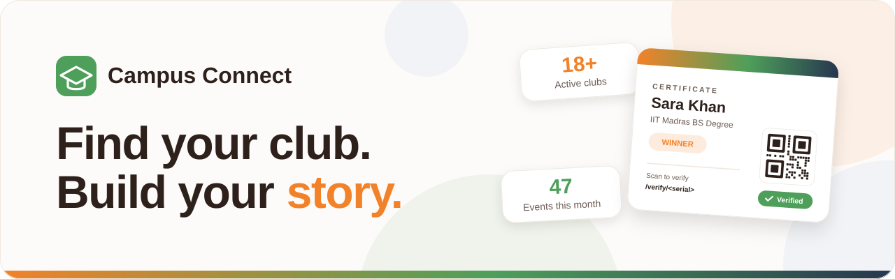
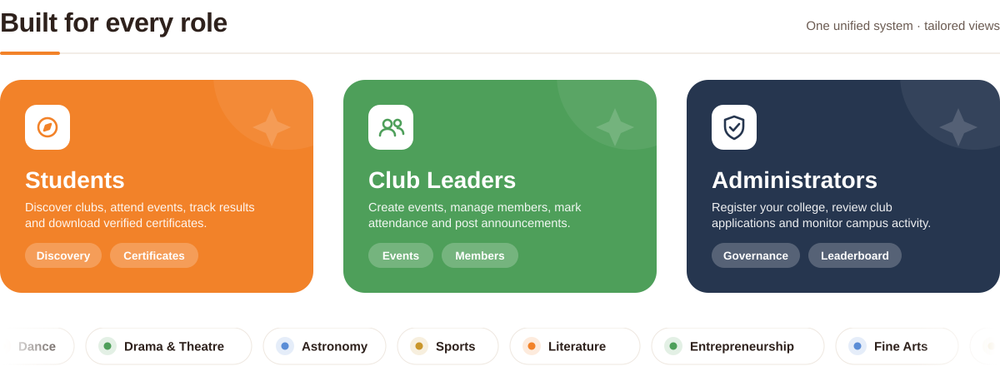
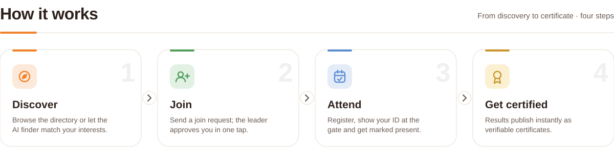
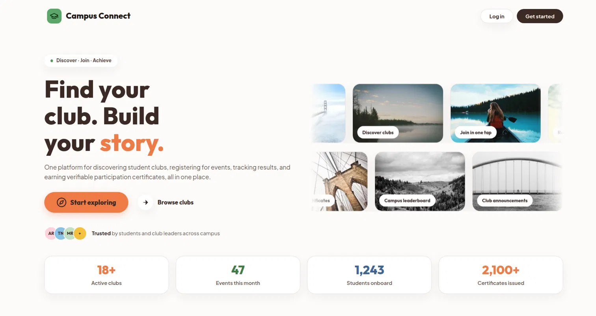
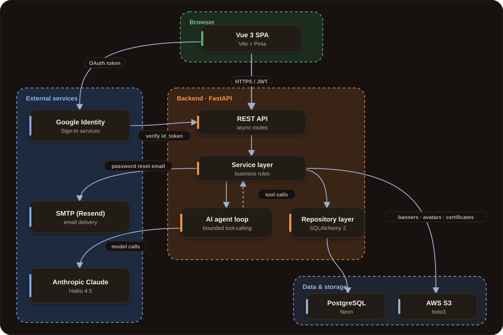
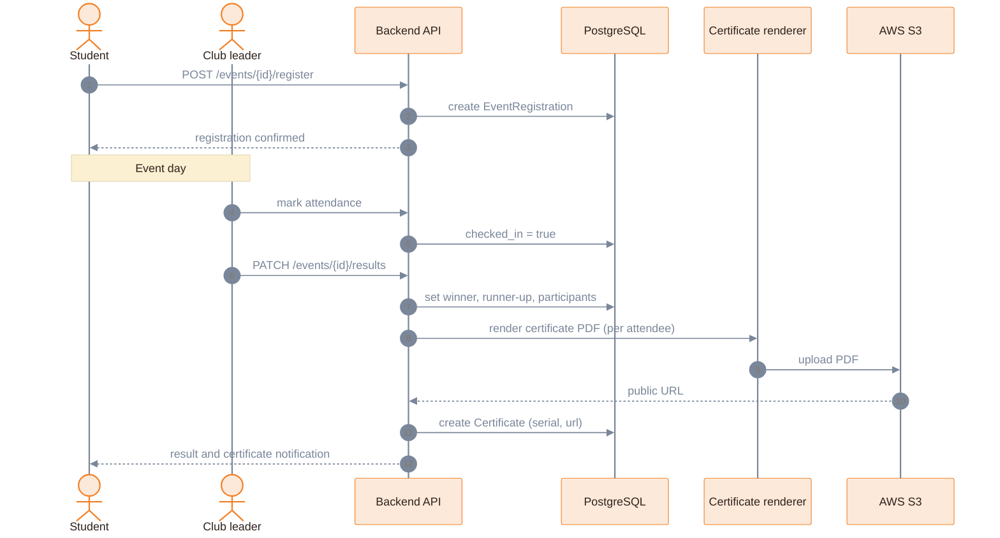
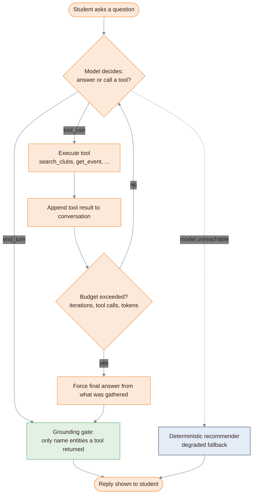
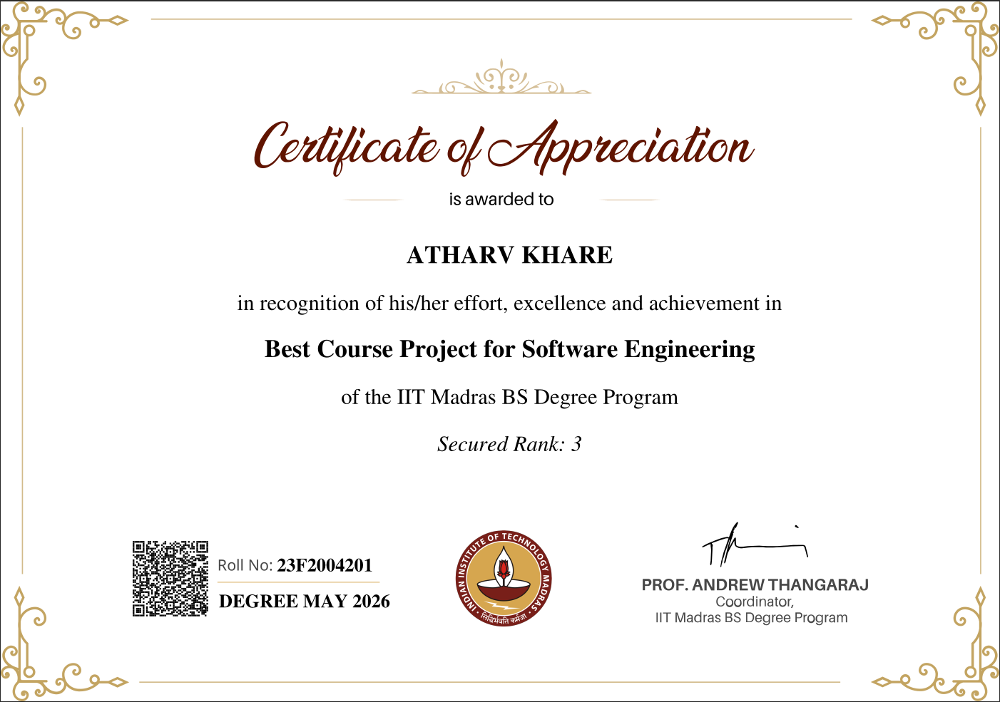

<div align="center">

<picture>
  <source media="(prefers-color-scheme: dark)" srcset="assets/banner-dark.svg">
  
</picture>

<br/>

[](https://campus-connect-swe.vercel.app/)
[](https://campusconnect.itshrestha.dev/docs)
[](backend/openapi.yaml)


**[Overview](#overview)** ·
**[Tech stack](#tech-stack)** ·
**[Architecture](#architecture)** ·
**[Getting started](#getting-started)** ·
**[Demo](#demo-accounts)** ·
**[Timeline](#timeline)** ·
**[Recognition](#recognition)** ·
**[Team](#team)**

</div>

<picture>
  <source media="(prefers-color-scheme: dark)" srcset="assets/divider-dark.svg">
  
</picture>

## Overview

**Campus Connect** is a multi-user platform that helps colleges run their student clubs end to end. Campus admins onboard the college and approve clubs, club leaders manage members, events and announcements, and students discover clubs, register for events and collect verifiable certificates.

| | |
|---|---|
| **Role-based dashboards** | Separate experiences for students, club leaders and campus admins |
| **Event lifecycle** | Draft, publish, register, mark attendance, declare results |
| **Verifiable certificates** | Auto-generated PDFs with a QR code that resolves to `/verify/<serial>` |
| **Leaderboard** | Clubs ranked on real activity scores |
| **Issue tracker** | Members raise issues and leaders answer them from a queue |
| **AI club finder** | A bounded tool-calling assistant that matches students to clubs |

### Built for every role

<picture>
  <source media="(prefers-color-scheme: dark)" srcset="assets/roles-dark.svg">
  
</picture>

### How it works

<picture>
  <source media="(prefers-color-scheme: dark)" srcset="assets/how-it-works-dark.svg">
  
</picture>

<picture>
  <source media="(prefers-color-scheme: dark)" srcset="assets/divider-dark.svg">
  
</picture>

## Screenshot

<div align="center">
<picture>
  <source media="(prefers-color-scheme: dark)" srcset="assets/landing.webp">
  
</picture>
<br/><br/>
</div>

## Tech stack

<table>
<tr>
<td width="50%" valign="top">

### Backend


`asyncpg` · `bcrypt` · `boto3` · `CairoSVG` · `qrcode`

</td>
<td width="50%" valign="top">

### Frontend


`jwt-decode` · `Vue Test Utils`

### Tooling


</td>
</tr>
</table>

<picture>
  <source media="(prefers-color-scheme: dark)" srcset="assets/divider-dark.svg">
  
</picture>

## Architecture

<div align="center">
<picture>
  <source media="(prefers-color-scheme: dark)" srcset="assets/architecture-dark.svg">
  
</picture>
</div>

The Vue 3 single-page app talks to the FastAPI backend over HTTPS with a JWT. Google Sign-In tokens are verified server-side. Routes call a service layer, which uses a repository layer for PostgreSQL and talks directly to S3 for banners, avatars and certificates. The AI agent loop calls Claude Haiku 4.5 and can call back into the service layer as tools.

### Event to certificate



### AI club finder

The assistant is a bounded tool-calling loop. It can only name clubs and events that a tool actually returned, and it falls back to a deterministic recommender if the model is unreachable.



<picture>
  <source media="(prefers-color-scheme: dark)" srcset="assets/divider-dark.svg">
  
</picture>

## Getting started

<details open>
<summary><b>Prerequisites</b></summary>

<br/>

- Python 3.12+ (managed by [uv](https://docs.astral.sh/uv/))
- Node 20+ and npm 10+
- A PostgreSQL database (plus a separate throwaway one for tests)

</details>

### 1. Clone

```bash
git clone https://github.com/Srivastava-Shrestha/MAY2026-Team-003.git
cd MAY2026-Team-003
```

### 2. Backend

```bash
# install uv (Linux/macOS)
curl -LsSf https://astral.sh/uv/install.sh | sh
# install uv (Windows)
powershell -c "irm https://astral.sh/uv/install.ps1 | iex"

cd backend
uv sync
cp .env.example .env        # then fill in the values
uv run alembic upgrade head
uv run uvicorn main:app --reload
```

The API runs at `http://localhost:8000`, with Swagger UI at `/docs` and ReDoc at `/redoc`.

> [!IMPORTANT]
> `DATABASE_URL` must use the `postgresql+asyncpg://` scheme. Point `TEST_DATABASE_URL` at a throwaway database: the test suite drops every table on teardown, so it must never share a database with `DATABASE_URL`.

Generate a JWT secret with:

```bash
python -c "import secrets; print(secrets.token_urlsafe(64))"
```

### 3. Frontend

In a new terminal:

```bash
cd frontend
npm install
```

Create `frontend/.env`:

```bash
VITE_API_URL=http://localhost:8000
VITE_GOOGLE_CLIENT_ID=your-google-oauth-client-id
```

`VITE_GOOGLE_CLIENT_ID` must match `GOOGLE_CLIENT_ID` in the backend `.env`. Leave it blank to run without Google Sign-In.

```bash
npm run dev
```

The app runs at `http://localhost:5173`.

<picture>
  <source media="(prefers-color-scheme: dark)" srcset="assets/divider-dark.svg">
  
</picture>

## Demo accounts

Every demo account signs in with the password `12345678`.

| Role | Email | What it demonstrates |
|---|---|---|
| **Campus Admin** | `shrestha@ds.study.iitm.ac.in` | Club approval queue, all clubs by status, college leaderboard |
| **Club Leader** | `aarav.menon@ds.study.iitm.ac.in` | Leads CodeCrafters with 5 members. Create and publish events, mark attendance, declare results, answer the issue queue, post announcements |
| **Member** | `sara.khan@ds.study.iitm.ac.in` | Holds 3 certificates (WINNER, RUNNER_UP, PARTICIPANT), plus notifications and event registrations |

<details>
<summary>More demo students</summary>

<br/>

All on `@ds.study.iitm.ac.in`: `diya.sharma`, `kabir.rao`, `ananya.iyer`, `meera.nair`, `rohan.gupta`, `ishita.bose`, `vikram.reddy`, `aditya.verma`, `nikita.joshi`, `arjun.pillai`.

</details>

### What the demo data covers

The demo runs on one full college, **IIT Madras BS Degree** (`ds.study.iitm.ac.in`). Club names, descriptions, logos and social links come from the real IITM BS societies. Every column of every table is populated and every enum value appears at least once.

| | Count | Details |
|---|:---:|---|
| **Clubs** | 7 | ACTIVE: CodeCrafters, IRIS, AKORD, RAAHAT. PENDING: Women in Tech. REJECTED: Heighers eSports. ARCHIVED: Deva-Bhasha Sanskrit Society |
| **Events** | 9 | 4 completed with results, 3 upcoming, 1 draft, 1 cancelled. One has no capacity limit |
| **Certificates** | 15 | Real PDFs with QR codes. 13 on S3 and 2 on the Postgres fallback path |
| **Memberships** | 23 | Approved, pending and rejected |
| **Announcements** | 7 | All 5 categories, 2 pinned |
| **Issues** | 6 | All 5 categories and all 3 statuses |
| **Notifications** | 10 | All 5 types |

<picture>
  <source media="(prefers-color-scheme: dark)" srcset="assets/divider-dark.svg">
  

  <br>
</picture>


## Recognition

🏆 **Campus Connect won the Best Project Award** in the BSCS3001 Software Engineering Project, IIT Madras BS Degree (May 2026).

<div align="center">
  
</div>


## Timeline

<a href="Milestones/Timeline.md">
<picture>
  <source media="(prefers-color-scheme: dark)" srcset="assets/timeline-dark.svg">
  
</picture>
</a>

Read the full dated breakdown in [`Milestones/Timeline.md`](Milestones/Timeline.md).

<picture>
  <source media="(prefers-color-scheme: dark)" srcset="assets/divider-dark.svg">
  
</picture>

## Team

**Team 003 (Nexmind)** 

| Member | Role | Commits | PRs (merged) | Branches |
|---|---|:---:|:---:|:---:|
| **Shrestha** | Backend and System Architect | 248 | 32 (27) | 21 |
| **Shrishti** | Frontend | 10 | 12 (10) | 10 |
| **Atharv** | Product Manager | 71 | 13 (13) | 7 |
| **Pawan** | Testing | 46 | 14 (13) | 13 |
| **Kavisha** | Scrum Master | 4 | 0 | 0 |
| `github-actions[bot]` | CI automation | 92 | 0 | 0 |
| | **Total** | **471** | **71 (63)** | **51** |


## Documentation

| Where | What |
|---|---|
| [`Summary.md`](Summary.md) | Project summary: problem, users, features, architecture and team |
| [`Milestones/Timeline.md`](Milestones/Timeline.md) | Dated project timeline from topic selection to the final submission |
| [`backend/README.md`](backend/README.md) | Backend setup, configuration and testing |
| [`frontend/README.md`](frontend/README.md) | Frontend setup, structure and design system |
| [`backend/openapi.yaml`](backend/openapi.yaml) | Full API spec with endpoints, user story mapping, role matrix and error catalogue |
| [`RULES.md`](RULES.md) | Team working agreement |

<br/>

<div align="center">

**Find your club. Build your story.**

Made by Team Nexmind | Thank you 🐻

Original repository: [Srivastava-Shrestha/MAY2026-Team-003](https://github.com/Srivastava-Shrestha/MAY2026-Team-003)

</div>
